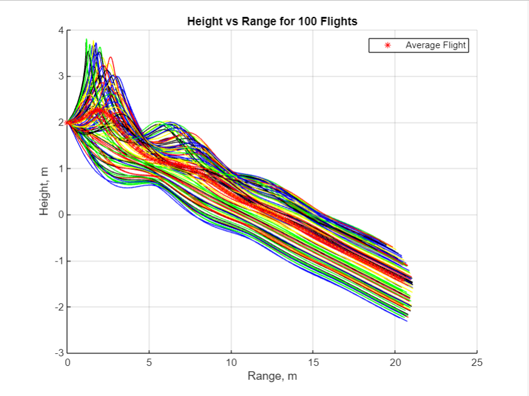
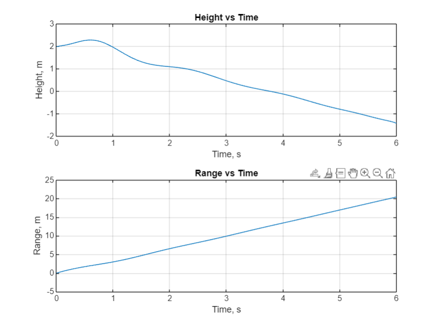
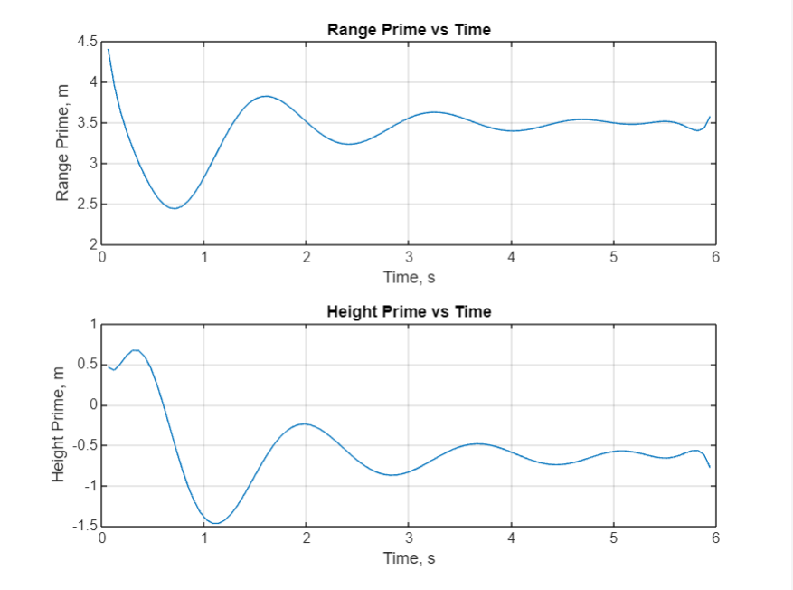

# Paper Airplane Numerical Study
  Final Project: AEM 3103 Spring 2024

  - By: Sam Reichenbacher

  ## Summary of Findings
  <Show the variations studied in a table>
    
|         | Velocity (M/S) | Flight Path Angle (Rad) |
|---------|----------------|-------------------------|
| Minimum | 2              | -.5                     |
| Nominal | 3.55           | -.18                    |
| Maximum | 7.5            | .4                      |
    

  This study created several possible flights for a paper airplane. I created a simulation of flights with different flight path angles, and flights with different starting velocities. Then I compared the results of each flight to see how changing each variable compared to each other.

  For changing velocities when v is maximized (Green line in [Figure 1](Figures/Figure1.png)) the plane quickly increases in altitude, then stalls before fluttering to the ground.
  Both the nominal flight path angle and velocity of the flights are mostly linear, other flights flutter a lot, but these flights are verry consistent.

  Then I created 100 different flights with varying initial velocities [+2, +7.5] m/s and flight path angles [-0.5, +0.4] rad. I then averaged all the flights range, time, and height to get an average (Expected) flight.

The flights with max FPA and Velocity flew in a loop to start the flight.
The average flight (Red Stars in [Figure 2](Figures/Figure2.png)) created a small hump in the beginning of the flight that slowly evened out as the flight went on.

  Then I created two plots of the average flight ((Range v Time) and (Height v Time)). Using these graphs, I fit a polynomial to each graph. Using the polynomials I found the derivative of both functions using [Num_Der_Cent](Num_Der_Cent.m). I Then plotted the derivatives of both polynomials.

  Range v Time is a fairly linear plot, but Height v Time is a bit more wavey.

  For the derivatives for each graph 
  Range' v Time is a negative sin wave that is dampened and converges to 3.5
  Height' v Time is a cos wave that is dampened to -.8
  
 
  # Code Listing
  A list of each function/script and a single-line description of what it does.  The name of the function/script should link to the file in the repository on GitHub.
  
  [Num_Der_Cent](Num_Der_Cent.m) This uses the central derivative method to take the derivative of a function 
  
  [EqMotion](EqMotion.m) This creates a flight trajectory for a paper plane given (t,x)

  # Figures

  ## Fig. 1: Single Parameter Variation
  <2D trajectory simulated by varying single parameter at time>

  

  This shows the plots for varying flight path angles and initial velocities. Green is the max value, red is the min, and black is the nominal value.

  ## Fig. 2: Monte Carlo Simulation
  <2D trajectories simulated using random sampling of parameters, overlay polynomial fit onto plot.>
  

  This shows 100 random flights with varying flight path angles and initial velocities that lie between the min and max values given in the first table.
  The red stars are the average flight.

 ## Fig. 3: Time Derivatives
 <Time-derivative of height and range for the fitted trajectory>
   

This shows both the Range vs Time and Height v Time of the average flight.
   

This shows the derivative of the Height and Range v Time graphs (Still for the average flight)
