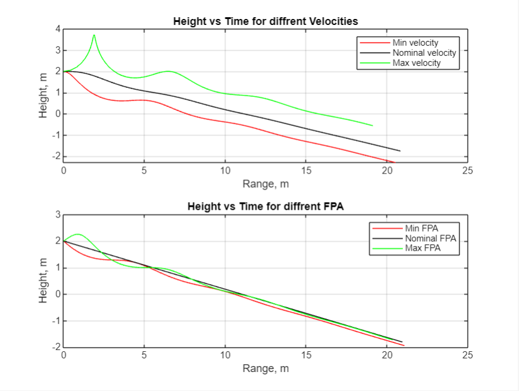

# Paper Airplane Numerical Study
  Final Project: AEM 3103 Spring 2024

  - By: Sam Reichenbacher

  ## Summary of Findings
  <Show the variations studied in a table>
    
|         | Velocity (M/S) | Flight Path Angle (Rad) |
|---------|----------------|-------------------------|
| Minimum | 2              | -.5                     |
| Nominal | 3.55           | -.18                    |
| Maximum | 7.5            | .4                      |
    

  This study created several posible flights for a paper airplane. I created a simulation of flights with diffrent flight path angles, and flights with diffrent starting velocities. Then I compaired the results of each flight to see how changing each variable compaired to eachother.

  For changing velocities when v is maximized (Green line) the plane quickly increases in altitude, then stalls before fluttering to the ground.
  Both the nominal flight path angle and velocity the flights are mostly linear, other flights flutter alot, but theis flights are verry consistant

  Then I created 100 diffrent flights with varying inital velocities [+2, +7.5] m/s and flight path angles [-0.5, +0.4] rad. I then averaged all of the flights range, time, and height to get an average (Expected) flight.

The flights with max FPA and Velocity flew in a loop to start the flight.
The average flight (Red Stars) created a small hump in the begining of the flight that slowly evened out as the flight went on.

  Then I created two plots of the average flight ((Range v Time) and (Height v Time)). Useing these graphs I fit a polynomial to each graph. Useing the polynomials I found the dirivative of both functions using [Num_Der_Cent](Num_Der_Cent.m). I Then ploted the dirivtiaves of both polynomials.

  Range v Time is a fairly linear plot, but Height v Time is a bit more wavey.

  For the dirivatives for each graph 
  Range' v Time is a negative sin wave that is dampened and converges to 3.5
  Height' v Time is a cos wave that is dampened to -.8
  
 
  # Code Listing
  A list of each function/script and a single-line description of what it does.  The name of the function/script should link to the file in the repository on GitHub.
  [Num_Der_Cent](Num_Der_Cent.m) This uses the centeral dirivative method to take the diricative of a function 
  [EqMotion](EqMotion.m) This creates a flight trajectory for a paper plane given (t,x)

  # Figures

  ## Fig. 1: Single Parameter Variation
  <2D trajectory simulated by varying single parameter at at time>
  <The above plot should also show the nominal trajectory>
  

  Briefly describe what is being shown in the figure.

  ## Fig. 2: Monte Carlo Simulation
  <2D trajectories simulated using random sampling of parameters, overlay polynomial fit onto plot.>

  Briefly describe what is being shown in the figure.

 ## Fig. 3: Time Derivatives
 <Time-derivative of height and range for the fitted trajectory>

  Briefly describe what is being shown in the figure.

  (Below are for teams of 2-3 people)
